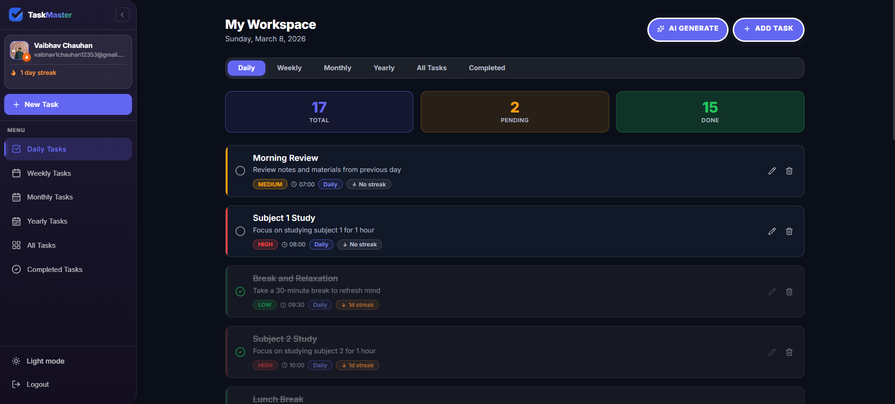
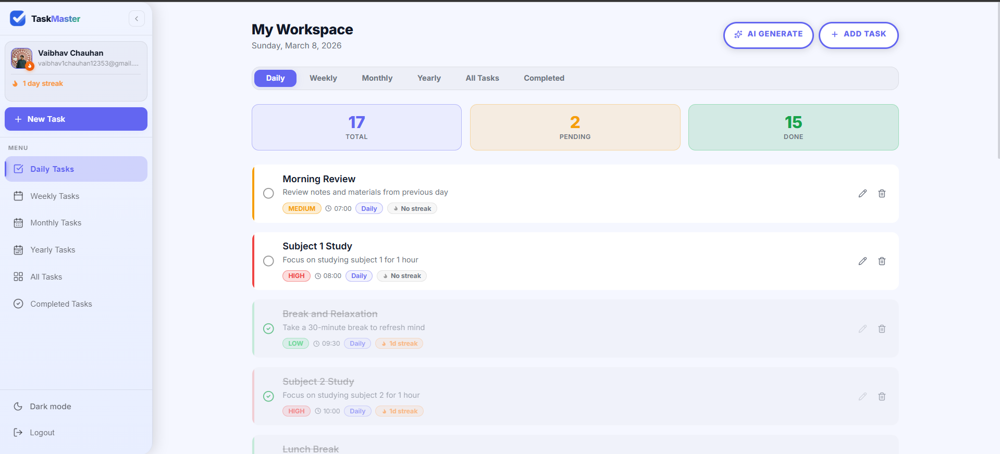
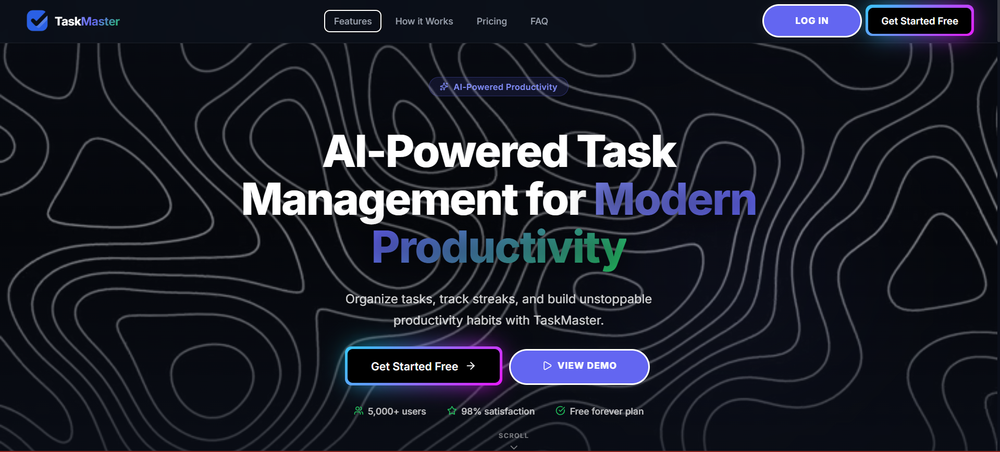

<div align="center">


# TaskMaster

### AI-Powered Task Management for Modern Productivity

Organize tasks, track streaks, and build unstoppable productivity habits with TaskMaster.


</div>

---

## 📸 Screenshots

| Dark Mode | Light Mode |
|-----------|------------|
|  |  |

**Landing Page**



---

## 🚀 Features

### 🤖 AI Task Generation
- Generate full task plans using **Groq AI** based on your goal type (study, fitness, productivity, work, personal)
- Choose time commitment: Light, Moderate, or Intense
- AI creates categorized daily, weekly, monthly, and yearly tasks automatically
- Review, edit, and selectively add AI-generated tasks before saving

### 📋 Task Management
- **Add, edit, and delete** tasks with full details
- Set **priority levels**: High, Medium, Low
- Set **due dates and times** with a date-picker and clock-time picker
- **Mark tasks as complete** with a single click
- **Drag-and-drop** reordering support

### 📅 Category Views
- **Daily Tasks** — tasks recurring every day
- **Weekly Tasks** — weekly goals and habits
- **Monthly Tasks** — longer-horizon planning
- **Yearly Tasks** — annual milestones
- **All Tasks** — unified view across all categories
- **Completed Tasks** — archive of finished tasks

### 🔥 Streak Tracking
- Each task tracks a personal **completion streak**
- Streak displayed on the sidebar (e.g. "1 day streak")
- Motivation to keep habits alive every day

### 📊 Stats Dashboard
- At-a-glance **Total / Pending / Done** counts at the top of the workspace
- Color-coded cards: blue (total), amber (pending), green (done)

### 🌗 Dark / Light Mode
- Full **dark and light theme** toggle
- Smooth, GPU-composited transition between themes
- Theme persists across sessions

### 🔐 Authentication
- **Sign up / Log in** via Supabase Auth
- Google OAuth and email/password support
- Protected routes — workspace only accessible when logged in
- User profile page with avatar display

### 📱 Fully Responsive
- Optimized for **desktop and mobile**
- Mobile bottom navigation bar for quick access
- Collapsible sidebar with persistent state

---

## 🛠️ Tech Stack

| Layer | Technology |
|-------|-----------|
| Frontend | React 18.2, TypeScript 4.9 |
| Routing | React Router DOM 6 |
| Styling | CSS Modules, MUI 5, Framer Motion |
| Forms | React Hook Form 7 + Zod validation |
| Backend / DB | Supabase (PostgreSQL + Auth) |
| AI | Groq API (llama-3 models) |
| Charts | Chart.js 4 + react-chartjs-2 |
| Drag & Drop | @hello-pangea/dnd |
| Icons | Lucide React |
| Deployment | Vercel |

---

## 📁 Project Structure

```
src/
├── ai/
│   └── groq.ts              # Groq AI API integration & rate limiter
├── components/
│   ├── AITaskPanel.tsx       # AI task generation drawer
│   ├── Layout.tsx            # Shell layout (sidebar + main)
│   ├── MobileBottomNav.tsx   # Mobile navigation bar
│   ├── Workspace.tsx         # Main task workspace view
│   ├── landing/              # Landing page sections
│   │   ├── Hero.tsx
│   │   ├── FeaturesSection.tsx
│   │   ├── HowItWorks.tsx
│   │   ├── PricingSection.tsx
│   │   ├── FAQSection.tsx
│   │   ├── Navbar.tsx
│   │   └── Footer.tsx
│   ├── sidebar/
│   │   ├── Sidebar.tsx
│   │   ├── SidebarContext.tsx
│   │   └── SidebarItem.tsx
│   ├── ui/
│   │   ├── Btn18.tsx         # Primary button component
│   │   ├── GlowButton.tsx    # Neon CTA button
│   │   ├── calendar.tsx
│   │   ├── date-picker.tsx
│   │   └── clock-time-picker.tsx
│   └── workspace/
│       ├── TaskCard.tsx
│       ├── TaskFormFields.tsx
│       ├── CategoryPills.tsx
│       ├── PriorityPills.tsx
│       ├── EmptyState.tsx
│       ├── DeleteDialog.tsx
│       ├── types.ts
│       └── useIsMobile.ts
├── contexts/
│   └── ThemeContext.tsx
├── lib/
│   └── supabaseClient.ts
├── pages/
│   ├── Home.tsx
│   ├── LandingPage.tsx
│   ├── Login.tsx
│   ├── Profile.tsx
│   └── Signup.tsx
├── services/
│   └── todoService.ts        # Supabase CRUD operations
└── styles/
    ├── App.css
    └── index.css
```

---

## ⚡ Getting Started

### Prerequisites

- Node.js 18+
- npm or yarn
- A [Supabase](https://supabase.com) project
- A [Groq](https://console.groq.com) API key

### 1. Clone the repository

```bash
git clone https://github.com/your-username/todo-tracker.git
cd todo-tracker
```

### 2. Install dependencies

```bash
npm install
```

### 3. Configure environment variables

Create a `.env` file in the root directory:

```env
REACT_APP_SUPABASE_URL=your_supabase_project_url
REACT_APP_SUPABASE_ANON_KEY=your_supabase_anon_key
REACT_APP_GROQ_API_KEY=your_groq_api_key
```

### 4. Set up the Supabase database

Run the following SQL in your Supabase SQL editor to create the `todos` table:

```sql
create table todos (
  id uuid default gen_random_uuid() primary key,
  user_id uuid references auth.users not null,
  title text not null,
  description text,
  priority text check (priority in ('low', 'medium', 'high')) default 'medium',
  category text check (category in ('daily', 'weekly', 'monthly', 'yearly')) default 'daily',
  status text check (status in ('pending', 'completed')) default 'pending',
  completed boolean default false,
  streak integer default 0,
  last_completed_date date,
  due_date date,
  due_time time,
  created_at timestamptz default now(),
  updated_at timestamptz default now()
);

-- Enable Row Level Security
alter table todos enable row level security;

create policy "Users can manage their own todos"
  on todos for all
  using (auth.uid() = user_id);
```

### 5. Start the development server

```bash
npm start
```

The app will open at [http://localhost:3000](http://localhost:3000).

### 6. Build for production

```bash
npm run build
```

---

## 🌐 Deployment

This project is configured for **Vercel** deployment via `vercel.json`.

```bash
# Install Vercel CLI
npm i -g vercel

# Deploy
vercel --prod
```

Set the same environment variables (`REACT_APP_SUPABASE_URL`, `REACT_APP_SUPABASE_ANON_KEY`, `REACT_APP_GROQ_API_KEY`) in your Vercel project settings.

---

## 🔑 Environment Variables

| Variable | Description |
|----------|-------------|
| `REACT_APP_SUPABASE_URL` | Your Supabase project URL |
| `REACT_APP_SUPABASE_ANON_KEY` | Your Supabase anonymous public key |
| `REACT_APP_GROQ_API_KEY` | Groq API key for AI task generation |

---

## 📄 License

This project is for personal and educational use. All rights reserved © Vaibhav Chauhan.
